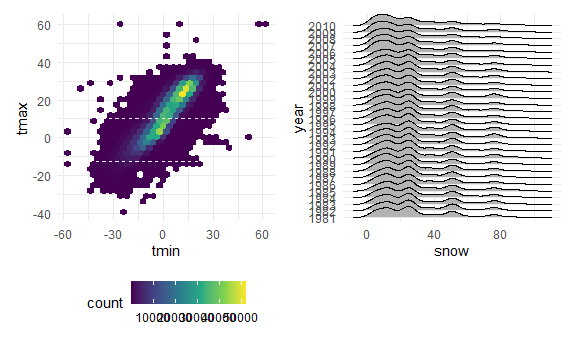

HW3
================
Chaoqun Zhou
2022-10-14

``` r
library(tidyverse)
library(readxl)
library(p8105.datasets)
library(patchwork)
library(ggridges)

knitr::opts_chunk$set(
    echo = TRUE,
    warning = FALSE,
  fig.width = 6,
  fig.asp = .6,
  out.width = "90%"
)
theme_set(theme_minimal() + theme(legend.position = "bottom"))
options(
  ggplot2.continuous.colour = "viridis",
  ggplot2.continuous.fill = "viridis"
)
scale_colour_discrete = scale_colour_viridis_d
scale_fill_discrete = scale_fill_viridis_d
```

# Problem 2

## Data Wrangling:

``` r
p2 = read_csv(file = "./data/accel_data.csv") %>% 
     janitor::clean_names() %>% 
     pivot_longer(activity_1:activity_1440,
                  names_to = "min_of_the_day",
                  values_to = "activity") %>% 
     mutate(min_of_the_day = str_sub(min_of_the_day, 10),
            day = str_to_lower(day),
            weekend = ifelse(day == "saturday"|day == "saturday", "TRUE", "FALSE"),
            weekend = as.logical(weekend),
            min_of_the_day = as.integer(min_of_the_day))
```

## Describe the resulting dataset.

This data set is about five weeks of accelerometer data collected on a
63 year-old male with BMI 25. So far, I have import the data into R. And
use `janitor::clean_names()` to clean up variables names. Now, this data
set has 6 variables and 50400 observations. It includes variables:
activity, day, day_id, min_of_the_day, week, weekend. I created a new
logical variable `weekend`. It is true when the `day` variable equals to
Sunday or Saturday, and FALSE when the `day` variable equal to weekdays.

## Create a new table showing total activity for each day

``` r
p2 %>% 
  group_by(week, day) %>% 
  summarise(activity_perday = sum(activity)) %>% 
  pivot_wider(
    names_from = day,
    values_from = activity_perday) %>% 
    select(monday, tuesday, wednesday, thursday, friday, saturday, sunday) %>% 
    knitr::kable(digits = 1)
```

| week |   monday |  tuesday | wednesday | thursday |   friday | saturday | sunday |
|-----:|---------:|---------:|----------:|---------:|---------:|---------:|-------:|
|    1 |  78828.1 | 307094.2 |    340115 | 355923.6 | 480542.6 |   376254 | 631105 |
|    2 | 295431.0 | 423245.0 |    440962 | 474048.0 | 568839.0 |   607175 | 422018 |
|    3 | 685910.0 | 381507.0 |    468869 | 371230.0 | 467420.0 |   382928 | 467052 |
|    4 | 409450.0 | 319568.0 |    434460 | 340291.0 | 154049.0 |     1440 | 260617 |
|    5 | 389080.0 | 367824.0 |    445366 | 549658.0 | 620860.0 |     1440 | 138421 |

As we can see from the table, there are days where this individual have
a lot of activity and days this individual has much less activity. Also,
there are two days where this individual doesn’t have activity (on
Saturday of week 4 and 5). For every minute of the day, the individual
only have 1 activity per minutes which probably means this individual
doesn’t carry this device with him.

## Making a plot

``` r
ggplot(p2, aes(x = min_of_the_day, y = activity, color = day)) +
    geom_line()
```


As we can see from the plot, this person lifestyle is pretty consistent.
The lines aggregated around some minutes. He gets up around 440 minutes
(about 7:20 am) of the day and goes to sleep around 1375 minutes (about
10:54 pm) of the day. Most of his activity occurs at the morning and
evening. His activity is lower during noon and the late afternoon.

# Problem 3

## Data import

``` r
data("ny_noaa")
p3 = janitor::clean_names(ny_noaa) %>% 
  separate(date, c("year", "month", "day"), convert = TRUE) %>% 
  mutate(prcp = prcp*0.1,
         tmax = as.numeric(tmax),
         tmax = tmax*0.1,
         tmin = as.numeric(tmin),
         tmin = tmin*0.1)
```

### MODE function

``` r
Mode <- function(x) {
  ux <- unique(x)
  ux[which.max(tabulate(match(x, ux)))]
}
```

## Describe the final data set

This data set is about weather data. It has 9 variables and 2595176
observations. It includes variables: day, id, month, prcp, snow, snwd,
tmax, tmin, year. Since each weather station only collect a subset of
all the variables, the resulting data contains tons of missing value.
When generating plot or calculating certain values or making statistical
inference, the missing value is going to be a problem. The final data
set has unit mm for precipitation `prcp`, snowfall `snow`, snow depth
`snwd`, and degree C for maximum temperature `tmax`, minimum temperature
`tmin`. For snowfall, the most commonly observed values is 0 mm. The
reason is that the weather in NY is pretty distinct. It only snow in
certain day during the winter. For most other day, there is no snow at
all.

## Making plots

``` r
p3 %>% 
  group_by(id, year, month) %>% 
  mutate(average_tmax = mean(tmax, na.rm = TRUE)) %>%
  filter(month == 1 | month == 7) %>% 
  ggplot(aes(x = year, y = average_tmax, 
             group = id, color = month)) + geom_line() + geom_point() + facet_grid(. ~ month)
```


As we can see from the resulting plot, the average_tmax seems to be
increasing across years both in January and July. We do see outliers.
Also, average_tmax in July is much higher than in January. Every station
has a similar trend of temperature change.

``` r
graph1 = p3 %>% 
  ggplot(aes(x = tmin, y = tmax, color = month)) + geom_hex()

graph2 = p3 %>% 
  filter(snow > 0 & snow < 100) %>% 
  mutate(year = as.character(year)) %>% 
  ggplot(aes(x = snow, y = year)) + geom_density_ridges()

graph1 + graph2
```


